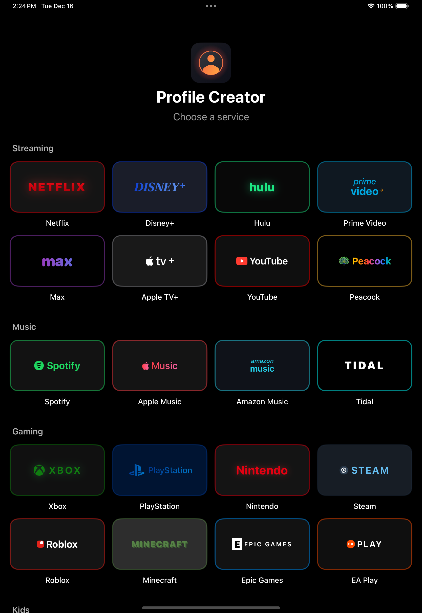
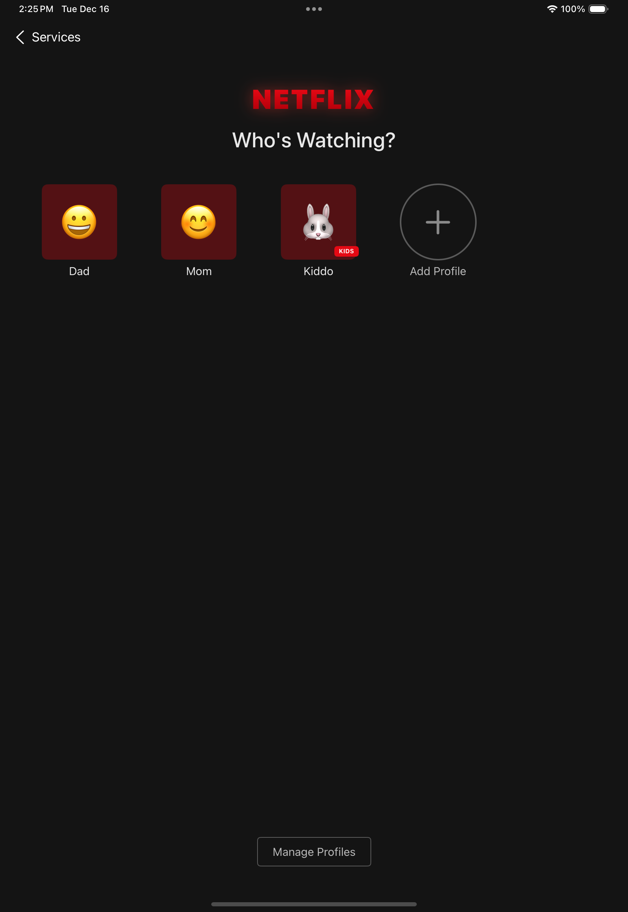
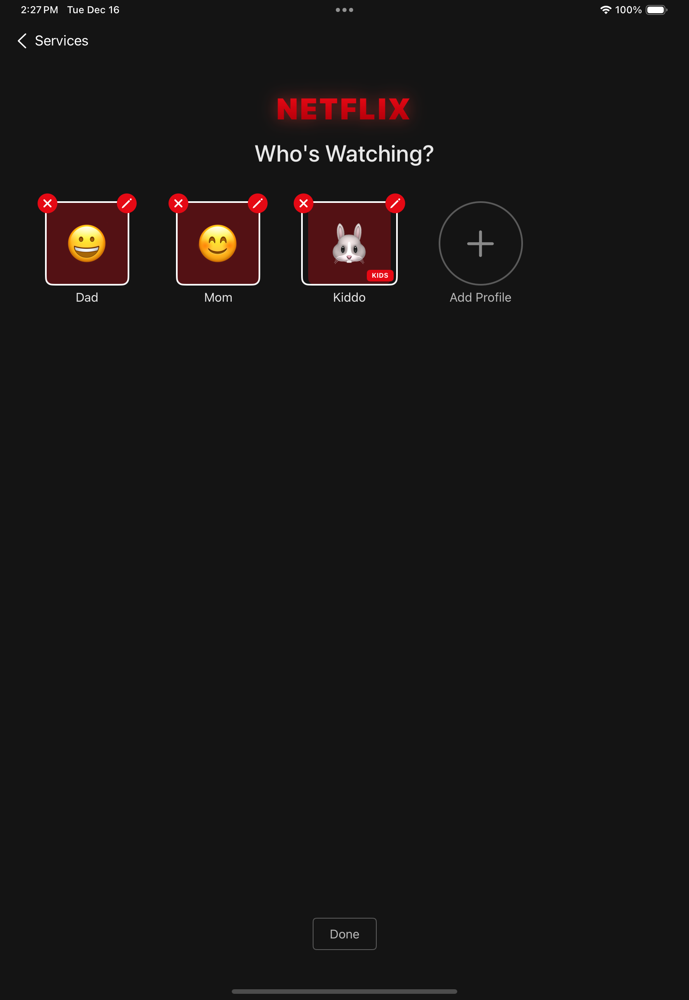
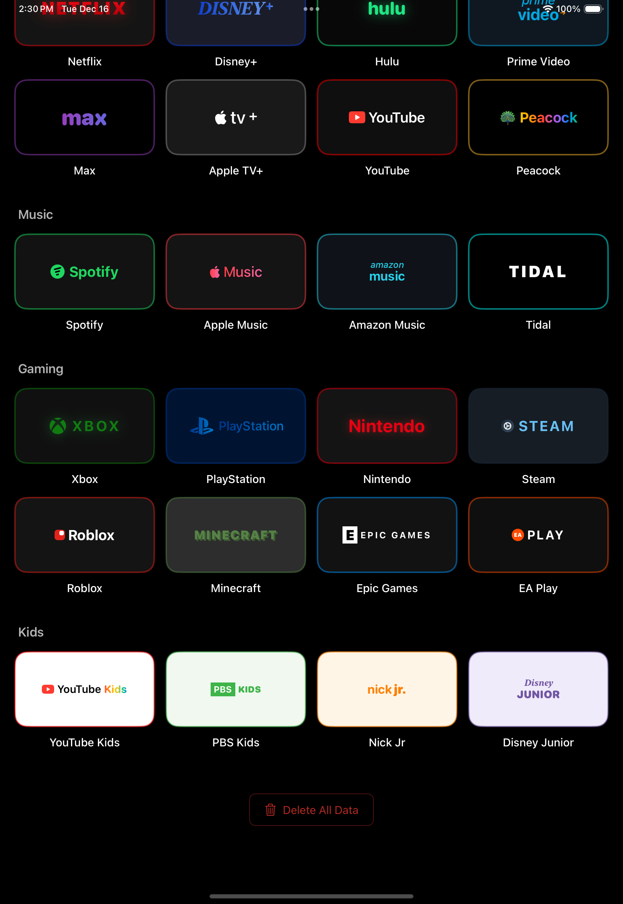

# Profile Creator

A fun iOS app that simulates the profile selection screens from popular streaming, music, and gaming services. Built with SwiftUI for iPad and iPhone.

## Screenshots

| Home | Profiles | Edit Mode | Add Profile |
|:----:|:--------:|:---------:|:-----------:|
|  |  |  |  |

## Features

- **24 Platform Themes** - Netflix, Disney+, Hulu, YouTube, Spotify, Xbox, PlayStation, and more
- **Custom Profiles** - Create profiles with emoji avatars or photos
- **Platform-Accurate Styling** - Each service has its own colors, logos, and visual style
- **Edit Mode** - Manage and delete profiles with intuitive controls
- **iCloud Sync** - Profiles sync across your devices
- **Kids Platforms** - YouTube Kids, PBS Kids, Nick Jr, and Disney Junior with kid-friendly themes
- **Splash Screen** - Animated intro when launching the app
- **Delete All Data** - Secure data deletion with confirmation

## Platforms

### Streaming
Netflix, Disney+, Hulu, Prime Video, Max, Apple TV+, YouTube, Peacock

### Music
Spotify, Apple Music, Amazon Music, Tidal

### Gaming
Xbox, PlayStation, Nintendo, Steam, Roblox, Minecraft, Epic Games, EA Play

### Kids
YouTube Kids, PBS Kids, Nick Jr, Disney Junior

## Requirements

- iOS 17.0+
- Xcode 15.0+

## Installation

1. Clone the repository
2. Open `ProfileCreator.xcodeproj` in Xcode
3. Build and run on your device or simulator

## License

This project is for educational and entertainment purposes.
